# Advanced Lane Finding

This project was created as an assessment for the [Self-Driving Car Nanodegree](https://www.udacity.com/course/self-driving-car-engineer-nanodegree--nd013) Program by Udacity. The goal is to detect lane lines on videos, calculate the curvature of the and the offset of the car.

## Result
### Images
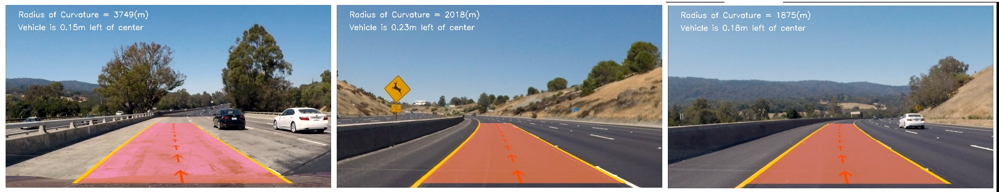

### Videos
Click on the image to play the video.

Track 1                       |  Track 1 + Debugging
:----------------------------:|:------------------------------:
 |  

Track 2                      |  Track 2 + Debugging
:----------------------------:|:------------------------------:
 |  

## Camera Calibration

Original                     |  Undistorted
:----------------------------:|:------------------------------:
| 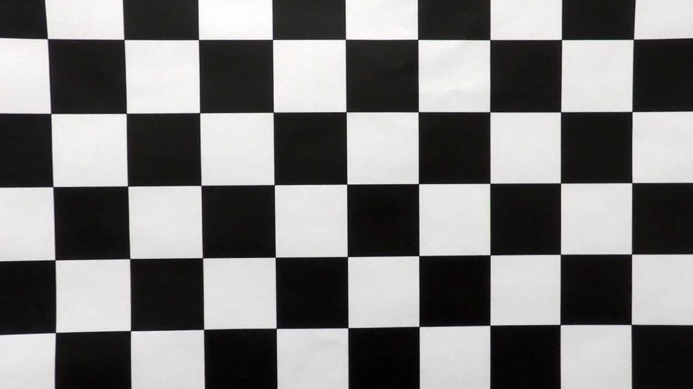

## Pipeline

### Undistortion
Original                     |  Undistorted
:----------------------------:|:------------------------------:
| 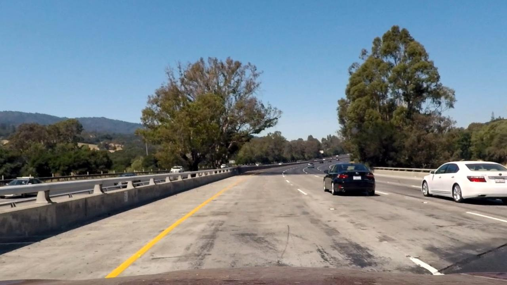

### Lane Masking
Sobel X & Y                   |  Magnitude & Direction of Gradient  | Yellow | Highlights | Combined
:----------------------------:|:-----------------------------------:|:------:|:----------:|:---------:
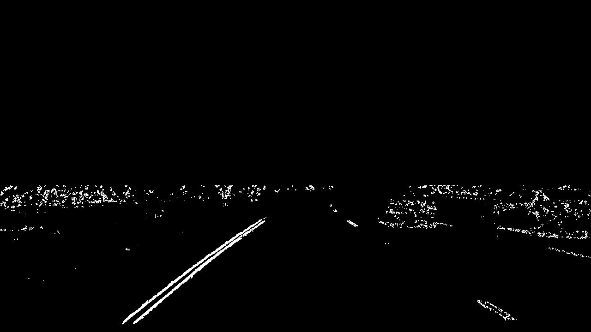| 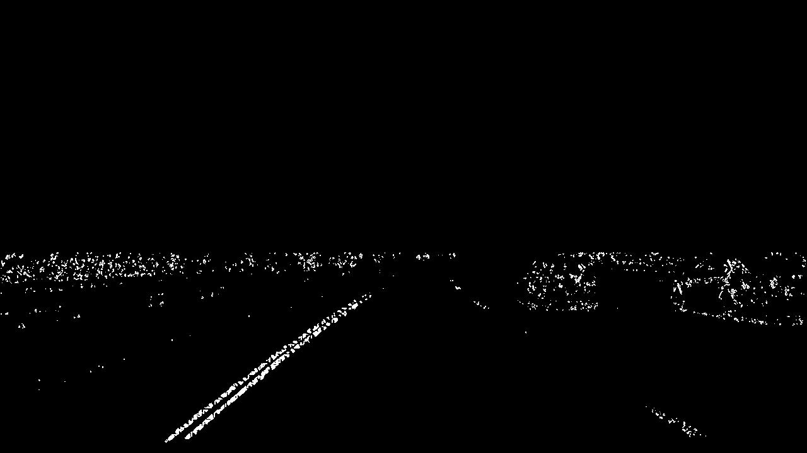 | 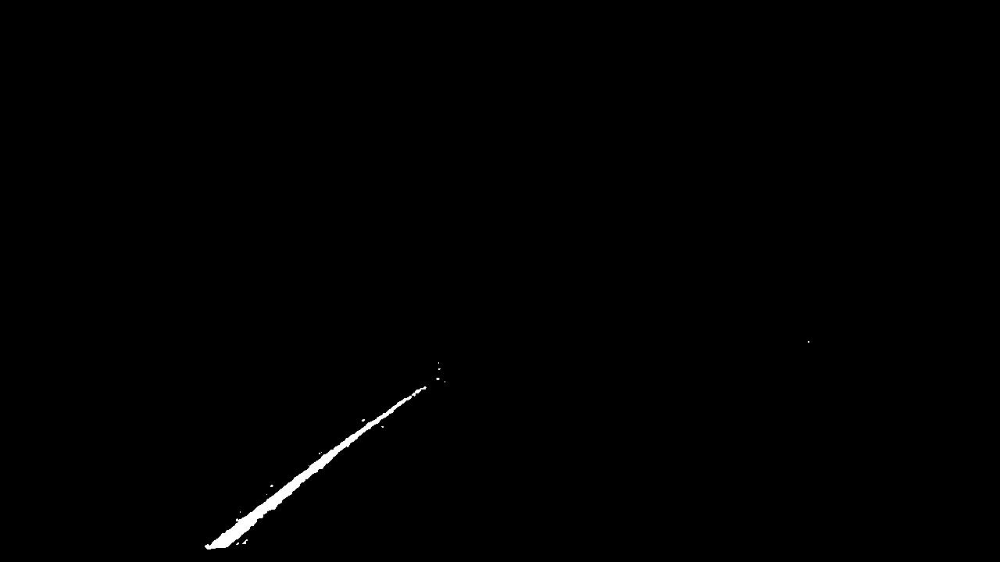 | 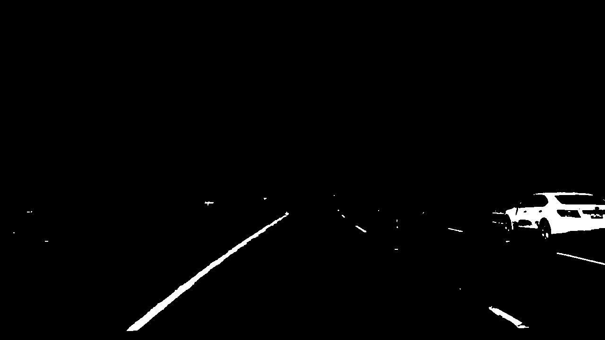 | 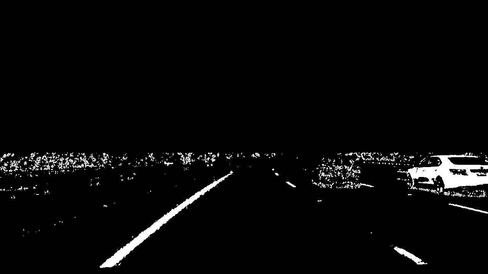

### Birdseye View
Source                        |  Transformed
:----------------------------:|:-----------------------------------------------------------:
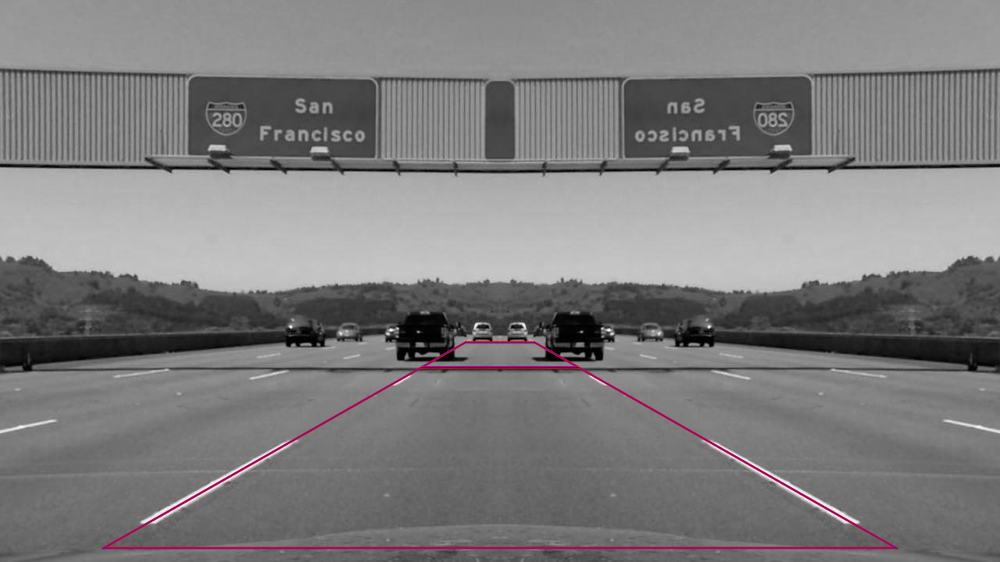| 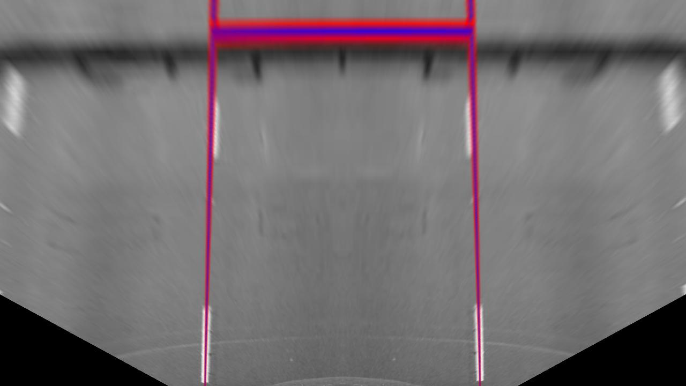

Mask                          |  Birdseye View
:----------------------------:|:-----------------------------------------------------------:
| 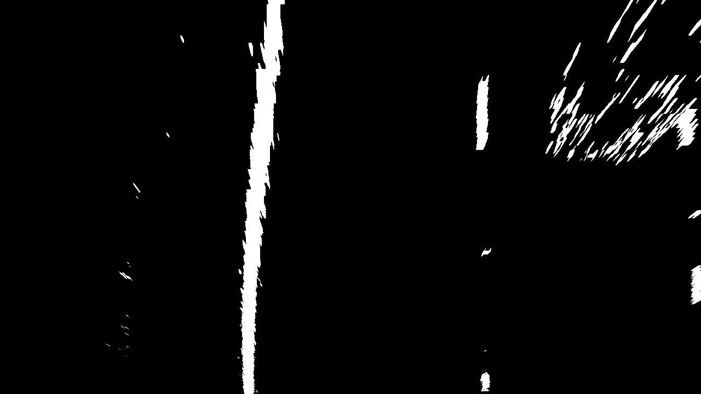

### Identify Pixels
Left Lane Histogram           | Right Lane Histogram           | Assigned Pixels
:------------------------------:|:------------------------------:|:------------------------------:
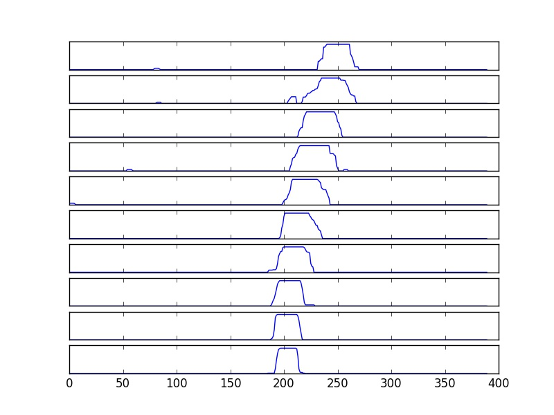 | 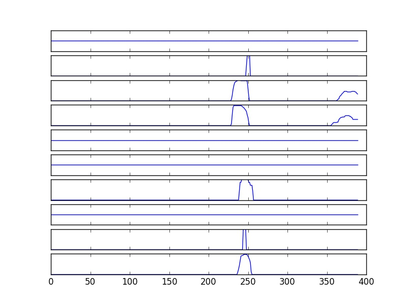 | 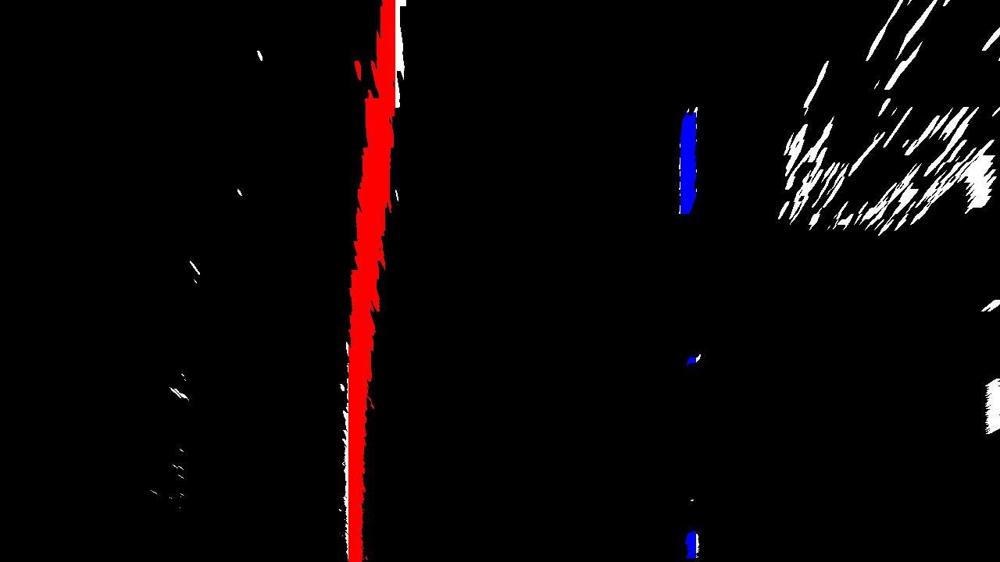

### Fit Polynomial
