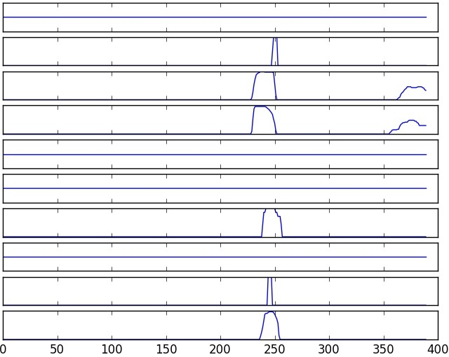

# Advanced Lane Finding

This project was created as an assessment for the [Self-Driving Car Nanodegree](https://www.udacity.com/course/self-driving-car-engineer-nanodegree--nd013) Program by Udacity. The goal is to detect lane lines on videos, calculate the curvature of the and the offset of the car.

## Result
### Images

### Videos
Click on the image to play the video.

Track 1                       |  Track 1 + Debugging
:----------------------------:|:------------------------------:
 |  

Track 2                       |  Track 2 + Debugging
:----------------------------:|:------------------------------:
 |  

## Camera Calibration

Images or videos captured by a camera are typically distorted by the lens. Using a image like that would cause problems
when trying to calculate the curvature or the cars offset to the center line. That's why at first the images have to be 
undistorted. For that a distortion matrix is calculated based on several images of a chessboard captured by the same 
camera. The matrix can then be used to undistort other images.

Original                      |  Undistorted
:----------------------------:|:------------------------------:
| 

## Pipeline

In the following section the different steps of the lane detection pipeline are described in the order they apply in the
algorithm.

### Undistortion

The first step is to remove the lens distortion by applying the calculated distortion matrix.

Original                      |  Undistorted
:----------------------------:|:------------------------------:
| 

### Lane Masking

After the lens distortion has been removed, a binary image will be created containing pixels which are likely part of a
lane. For that the result of multiple techniques are combined by a bitwise and. Finding good parameters for the different
techniques like threshold values is quite challenging. To improve the feedback cycle of applying different parameters a
interactive [jupyter notebook](Interactive Parameter Exploration.ipynb) was created.
  
The first technique is called sobel operation which is able to detect edges by computing an approximation of the 
gradient of the image intensity function. The operation was applied for both directions (x and y) and combined to keep only
those pixel which are on both results and also over a specified threshold. As input an averaged gray scale image from
the U and V color channel of the YUV space and also the S channel of the HLS space was used. 
  
Additionally the magnitude and direction of gradient was calculated and combined by keeping only pixels with values above
a threshold (different threshold for magnitude and direction) on both images.
  
Technique number three is basic color thresholding which tries to isolate yellow pixels.
  
The last technique is an adaptive highlight / high intensity detection. It isolates all the pixels which have values above
a given percentile with the goal to make it more robust against different lighting conditions.
  
In the end the results are combined through a bitwise or get the final mask.

Sobel X & Y                   |  Magnitude & Direction of Gradient  | Yellow | Highlights | Combined
:----------------------------:|:-----------------------------------:|:------:|:----------:|:---------:
|  |  |  | 

### Birdseye View
To determine suitable source coordinates for the perspective transformation a image with relative straight lines was
used as reference. Since the car was not perfectly centered the image was horizontally mirrored. The resulting image
was then used inside the interactive [jupyter notebook](Interactive Parameter Exploration.ipynb) to fit vanishing lines and get source coordinates.

Reference                     |  Transformed
:----------------------------:|:-----------------------------------------------------------:
| 

After suitable coordinates were determined the transformation can applied to other images. This of course is just an
approximation and is not 100% accurate. 

Mask                          |  Birdseye View
:----------------------------:|:-----------------------------------------------------------:
| 

### Identify Pixels

Since not all pixels marked in the mask are actually part of the lanes the most likely ones hae to be identified. For that
a sliding histogram is applied to detect clusters of marked pixels. The highest peak of each histogram is used as the center
of a window which assigns each pixel inside to the corresponding lane. The sliding histogram is applied to the left half
of the image to detect left line pixels and applied on the right half of the image to detect right lane pixels. Therefore 
the algorithm will fail if a lane crosses the center of the image.
  
This process is pretty computing intensive. That's why the algorithm will try to find lane pixels in the are of
previously found lines first. This is only possible in when using videos.

Left Lane Histogram             | Assigned Pixels                | Right Lane Histogram           
:------------------------------:|:------------------------------:|:------------------------------:
 | |  

### Fit Polynomial

With pixels assigned to each lane, second order polynomials can be fitted. To achieve smoother results the polynomials 
are also average over the last five frames in a video. The polynomials are also used to calculate the curvature of the lane
and the relative offset from the car to the center line.

Fit Polynomial                | Final
:----------------------------:|:-----------------------------------------------------------:
| 